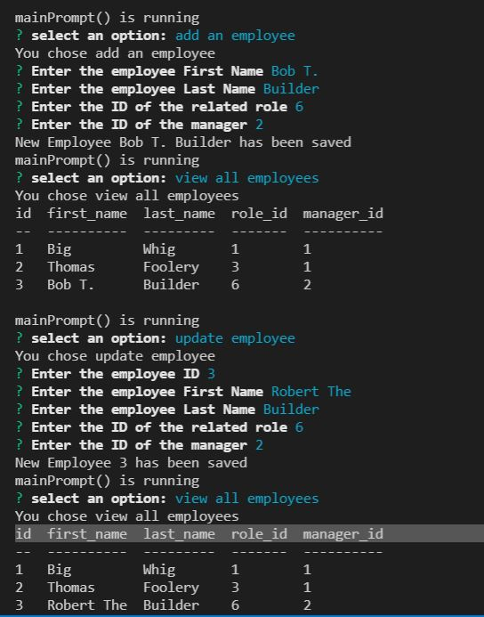

  

  # employee_tracker

  This application allows a user to tracker departments, roles and employees for a business.  Each data type has a relationship allowing the user to track organizational structure.

  This application is for the University of Minnesota Fall 2021 Coding Bootcamp, assignment 12.  Fulfilling this user story:  
    
    AS A business owner  
    I WANT to be able to view and manage the departments, roles, and employees in my company  
    SO THAT I can organize and plan my business  

  ## Table of Contents

  - [Installation](#Installation)  
  - [Usage](#Usage) 
  - [Contributor](#Contributor)  
  - [Tests](#Tests)  
  - [Questions](#Questions)  
  - [License](#License)  

  ## Installation

  To install this application you will need to down load the application and run NPM install.  Following that the database connection information in index.js will need to be updated to access your instance of mysql.

  ## Usage

  Simply follow the prompts

  See Video

  

  ## Contributor

  https://github.com/GitAndrewCoffee

  Using:

  - JavaScript
  - Node
  - NPM  
  - NPM Inquirer
  - Mysql
  
  ## Tests

  There are no unit tests for this application.

  ## Questions

  No Open Questions
  
  ## License

  Please visit this link for license details: https://opensource.org/licenses/MIT
